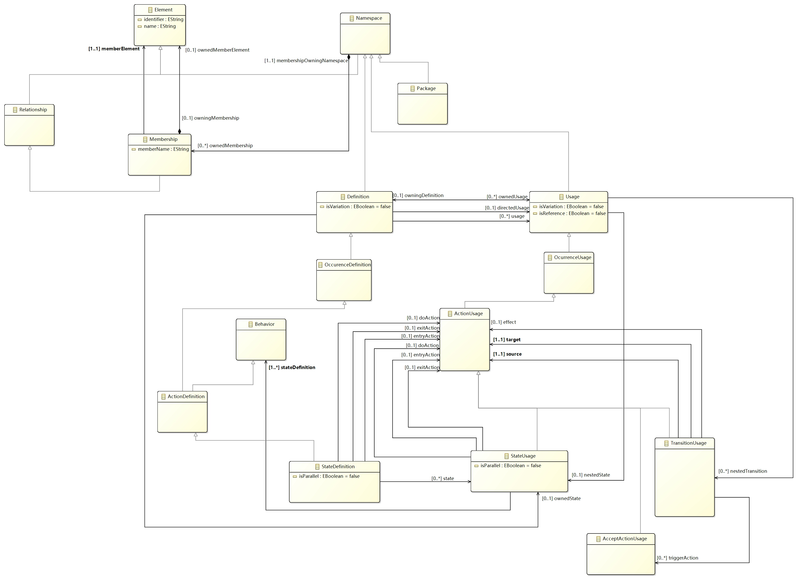

# 第一次独立作业元模型

本模型为SysMLv2的状态机部分。

## StateDefinition与StateUsage

StateDefinition和StateUsage分别是State的定义与具体环境下的使用。

entryAction，doAction和exitAction分别是不同生命周期进行的活动。

isParallel标识改State是否为并发状态。

## TransitionUsage

source为Transition的源。

target为Transition的目标。

effect为Transition执行时同时被执行的行为。
