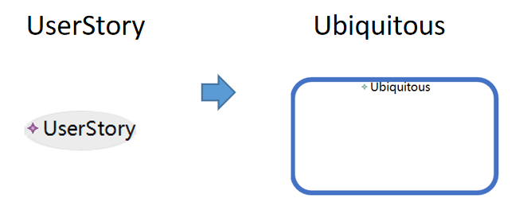
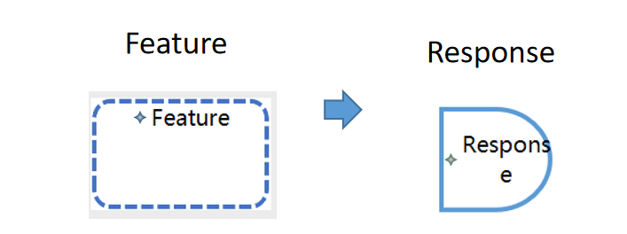
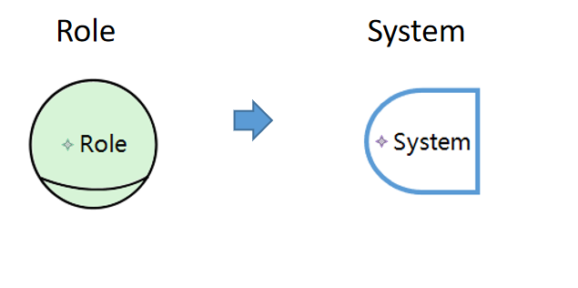
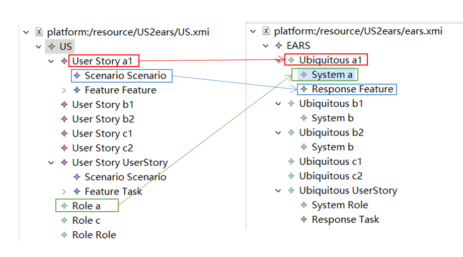

# 用户故事到EARS的转换

转换说明：转换规则目前有三个：
               
用户故事UserStory到EARS中Ubiquitous（普遍事件）的转换。
>
                 
用户故事Feature（功能）到EARS中Response（系统响应）的转换。
>
                       
用户故事Role到EARS中System（系统）的转换。
>

转换结果的XMI映射关系。
>
