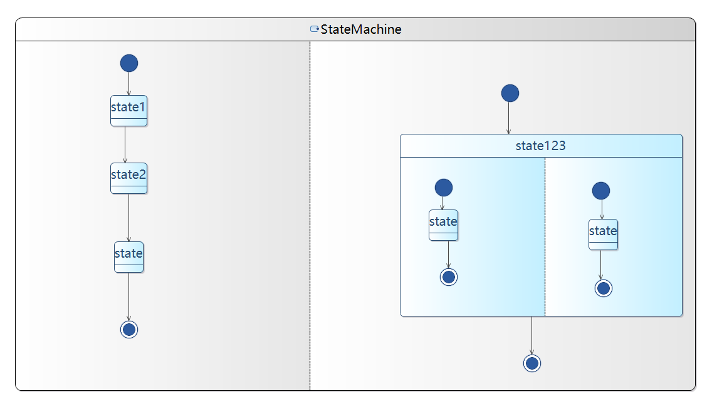
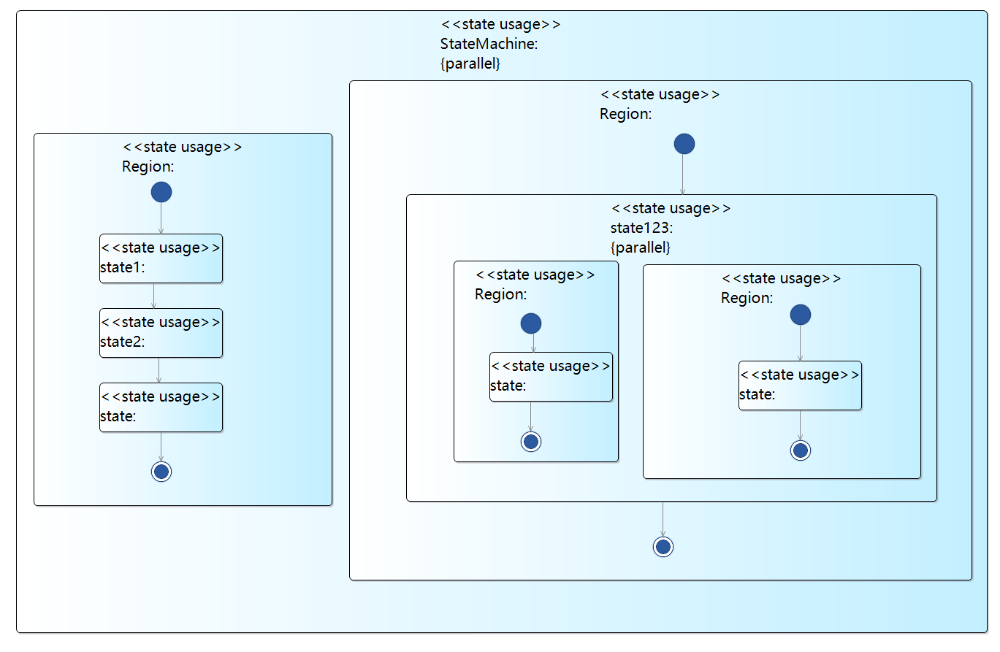
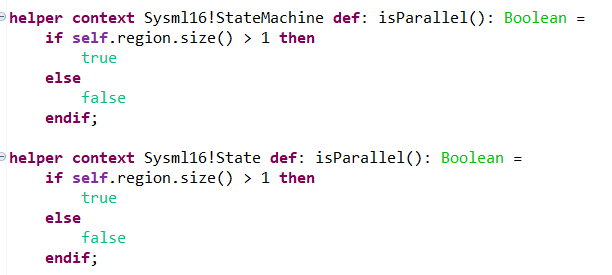
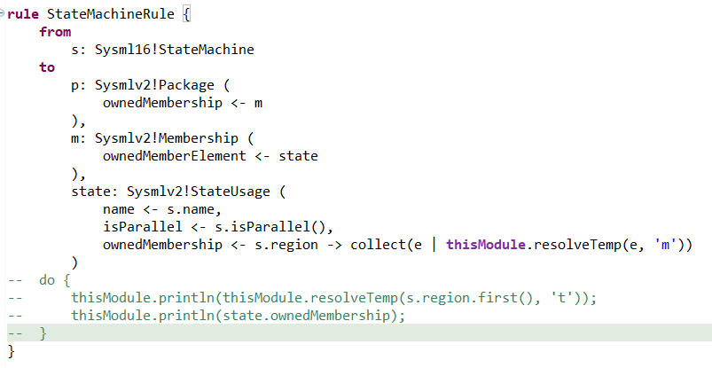
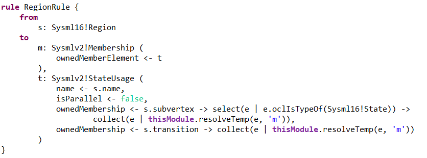
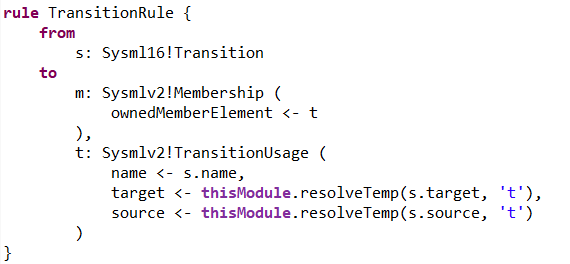
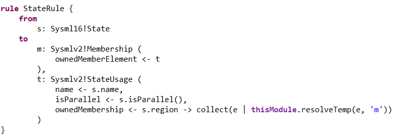

# 第三次独立作业ATL

源：SysML 1.6的StateMachine

目标：SysMLv2的StateMachine

## 转换实例

源：

转换结构：

## ATL

### Helper

两个helper用于判断是否并发。

### Statemachine

StateMachine转换规则，其中p是SysMLv2中的Package，当作目标模型中的根元素。

m为SysMLv2中的Membership用于连接下一层的State。

state为SysMLv2中的StateUsage，其子元素为Statemachine中Region转换后的元素

### Region

Region转换规则。其中t为Region转换后的StateUsage，其内部元素为Region内部的State和Transition转换后的元素

### Transition

Transition转换规则。需要指定target和source为源模型中targe和source转换后的元素。

### State

状态的转换规则。内部写法和StateMachine中的StateUsage那部分一致，内部元素都是Region转换后的元素。
