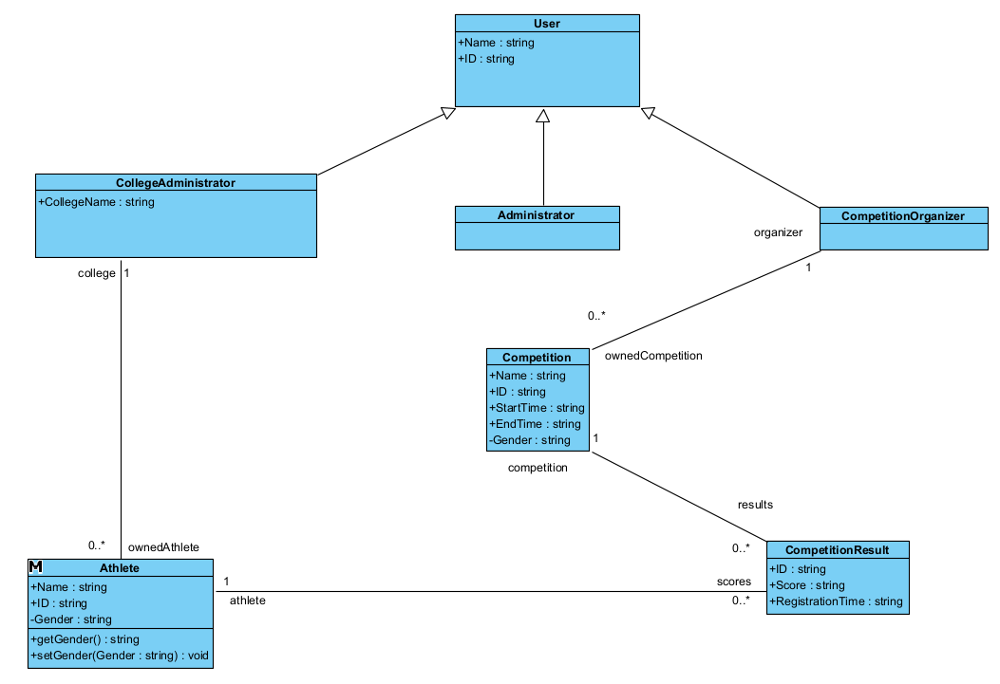
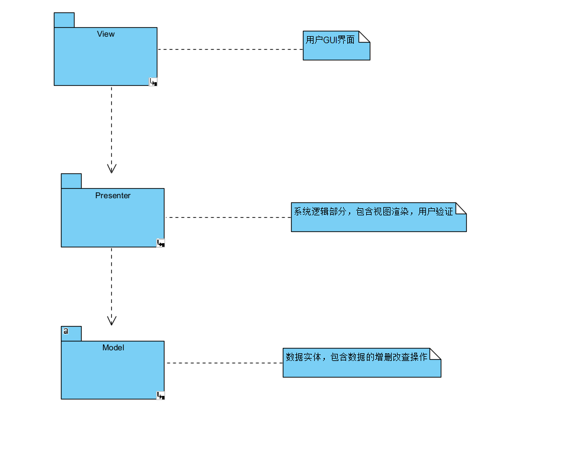

# 第三次大作业

## 类图

>

## 时序图
### Athlete Registration
>

### Competition Registration
>

### Modify Athlete
>

### Modify Competition
>

### Upload Competition Results
>

### View Competition Results
>

## 包图

>

## 架构设计
### 过滤器模式（Filter Pattern）
>

### 适配器模式（Adapter Pattern）

>
