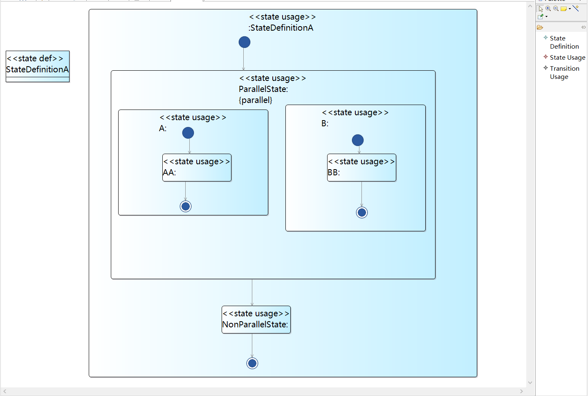
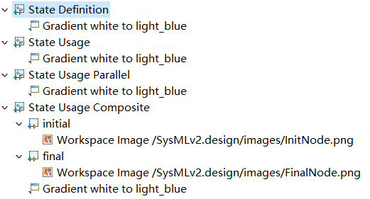
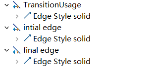
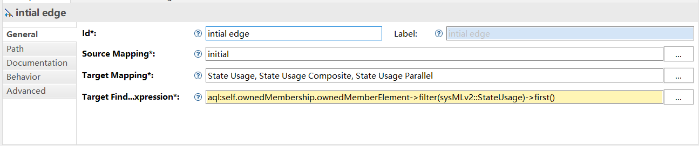
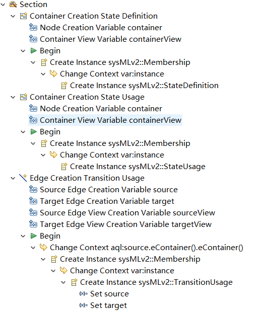

# 第二次独立作业Sirius

右边的添加元素工具栏有StateDefinition，StateUsage和TransitionUsage三项。

并发State和非并发State显示有区别需要分别开发。

## StateDefinition与StateUsage

StateUsage需要依据情况定义成三种样式，分别是最简单的StateUsage，带内部元素的StateUsage Composite，并发的StateUsage Parallel。

其中StateUsage Compostie需要自带初始点（initial）和结束点（final）。

### Transition

除了用户连接的Transition需要定义，还需要定义一开始就有的从Initial点出来的Transition和指向Final的Transition。

以Intial edge为例，source绑定在intial这个node上，目标为第一个状态。

### Section

工具栏的定义，需要注意的是因为SysMLv2模型之间的包含关系需要有membership这个元素作为连接，所以添加元素的操作需要

* 创建一个Membership
* 改变上下文到刚刚创建的Instance，也就是Membership
* 继续创建所需要的元素（Stateusage，StateDefinition，Transition）

Transition需要注意Set source和target
